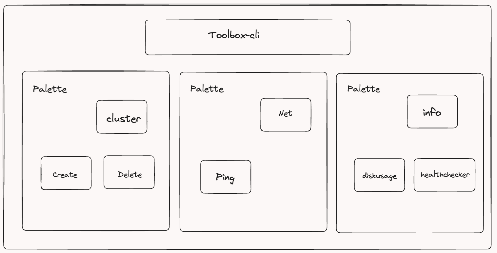

# Toolbox

Toolbox is a command-line interface (CLI) tool written in Go. It leverages the power of Cobra, a CLI library for Go, to offer a seamless user experience.

## Overview
<p align="center">
  
</p>

## Usage

To use Toolbox, simply execute the following command:

```
./toolbox [command]
```


## Available Commands

- cluster: Create and manage AWS EC2 instances.
- net: Perform network-related tasks using a comprehensive set of commands.
- info: Retrieve detailed information about all available commands.
- healthcheck: Command that checks health of given domain.

### Cluster Command

The `cluster` command allows you to create and manage AWS EC2 instances. You can create instances and delete instances associated with a cluster.

## Flags
- -h, --help: Display the help information for Toolbox.
- -t, --toggle: Display a help message for the toggle feature.

## Getting Started
To get started with Toolbox, follow the steps below:

1. Clone the Toolbox repository from GitHub:
```
git clone https://github.com/YashPimple/toolbox-cli.git
```

2. Build the Toolbox executable:

```
go build -o toolbox
```

3. Run Toolbox with the desired command:
```
./toolbox [command]
```

For more detailed information about each command, use the following syntax:

```
./toolbox [command] --help
```

Contributing
We welcome contributions to Toolbox! If you would like to contribute, please follow these steps:

- Fork the Toolbox repository.
- Create a new branch for your feature or bug fix.
- Make the necessary changes and commit them.
- Push your changes to your forked repository.
- Submit a pull request to the main Toolbox repository.

## License
This project is licensed under the MIT License. Please see the LICENSE file for more details.
